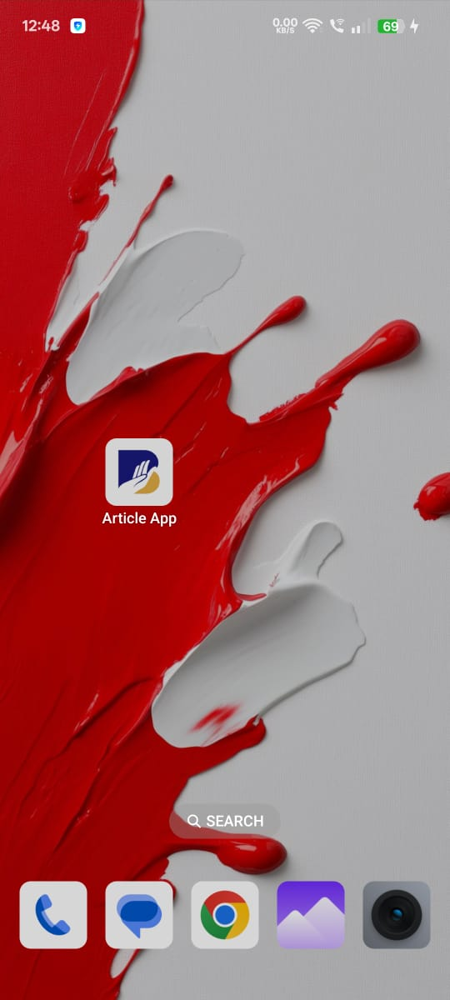
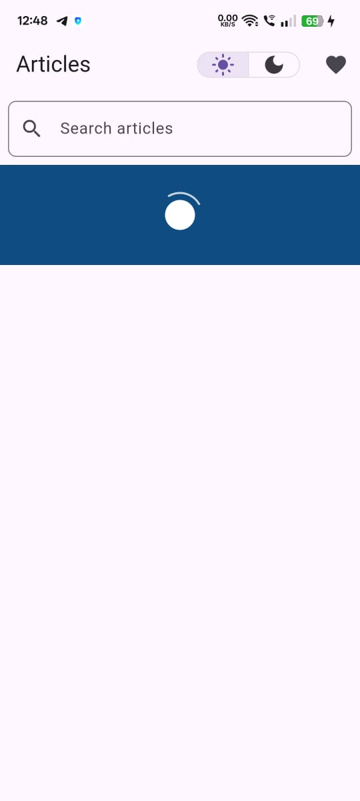

# Flutter Article App
<div>
<br/>
</div>


A Flutter app that fetches and displays a list of articles from a public API. The app allows users to browse, search, view article details, and mark articles as favorites.

---

## Features

### Core Functionality

✅ **Article List (Home Screen)**  
- Fetches articles from [jsonplaceholder.typicode.com/posts](https://jsonplaceholder.typicode.com/posts).  
- Displays articles in a **ListView** with cards showing the **title** and a short preview of the body.  
- Shows a **loading indicator** while articles are being fetched.  
- Handles API **errors gracefully**, displaying an error message and a retry option.  

✅ **Search Functionality**  
- Real-time **search bar** that filters articles by **title** or **body**.  
- Instant results update without requiring additional API calls.  

✅ **Article Details Screen**  
- Users can **tap** on an article to navigate to a **dedicated detail screen**.  
- Displays the **full article title & body** for deeper reading.  

---

### Enhanced UX Features

🎨 **Dark Mode & Light Mode**  
- Fully **theme-adaptive UI**, allowing users to switch between light and dark modes.  
- **ThemeCubit** ensures seamless UI updates across the app.  

🔄 **Pull-to-Refresh** *(Bonus feature!)*  
- Users can **swipe down** to refresh articles manually.  
- Ensures latest content is loaded without restarting the app.  

❤️ **Favorite Articles** *(Bonus feature!)*  
- Allows users to **mark articles as favorites** with a heart-shaped toggle button.  
- Favorites **persist using Hive**, ensuring they remain saved after the app is closed.  

📁 **Local Storage (Hive Integration)** *(Bonus feature!)*  
- Stores favorite articles **locally**, eliminating reliance on an internet connection for favorite tracking.  
- Fast access and efficient state management using **Flutter BLoC** and **Hive**.  

---

### What Makes This App Stand Out?

🚀 **Fast & Responsive:** Uses **Flutter BLoC** for smooth state management and avoids unnecessary rebuilds.  
📱 **Optimized for Performance:** Efficient API handling & caching via Hive and optimized ListView rendering.  
🔗 **Offline-Friendly Favorites:** Saves your favorite articles **locally**, so you don't lose them when offline.

---

## Setup Instructions

1. **Clone the repo:**
```

git clone https://github.com/ShivtejBhilare/flutter_article_app
cd flutter_article_app

```

2. **Install dependencies:**
```

flutter pub get

```

3. **Run the app:**
```

flutter run

```

---

## Tech Stack

- **Flutter SDK:** Flutter 3+
- **State Management:** BLoC (using flutter_bloc)
- **HTTP Client:** http (for API calls)
- **Persistence:** Hive (for storing favorites)

---

## State Management Explanation

This app uses the **BLoC (Business Logic Component) pattern** for state management. BLoC separates business logic from the UI, ensuring a clean, maintainable, and testable codebase. Events-such as user actions-are dispatched to the BLoC, which processes them and emits new states. The UI listens to these state changes and rebuilds automatically, resulting in a responsive and scalable application architecture. This unidirectional data flow enhances separation of concerns and makes the app easier to extend and debug.

---

## Known Issues / Limitations

- Additional error handling could be implemented for various network scenarios.
- The UI could be further refined for responsiveness on different screen sizes.

---

## Screenshots

<div align="center">

<table>
<tr>
 <td align="center" width="160">
   <br/>
   <sub>App Icon & App Name</sub>
 </td>
 <td align="center" width="160">
   <br/>
   <sub>Splash Screen</sub>
 </td>
 <td align="center" width="160">
   <br/>
   <sub>Home Screen - Light Mode</sub>
 </td>
</tr>
<tr>
 <td align="center" width="160">
   <br/>
   <sub>Home Screen - Dark Mode</sub>
 </td>
 <td align="center" width="160">
   <br/>
   <sub>Article Details Screen</sub>
 </td>
 <td align="center" width="160">
   <br/>
   <sub>Loading animation</sub>
 </td>
</tr>
</table>

</div>

## About

This project was developed as part of the BharatNXT Flutter Developer Assignment.

Feel free to adjust any sections or update the image paths to match your project assets.

---

## Contact

**Shivtej Bhilare**  
📧 [bhilareshivtejofficial@gmail.com](mailto:bhilareshivtejofficial@gmail.com)  
[](https://www.linkedin.com/in/shivtejbhilare/)[ shivtejbhilare](https://www.linkedin.com/in/shivtejbhilare/)
---