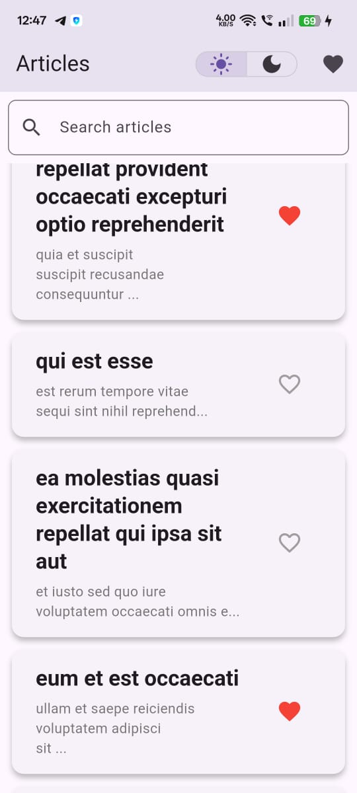
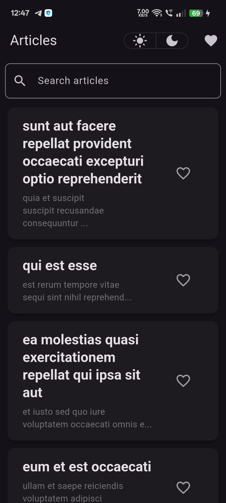
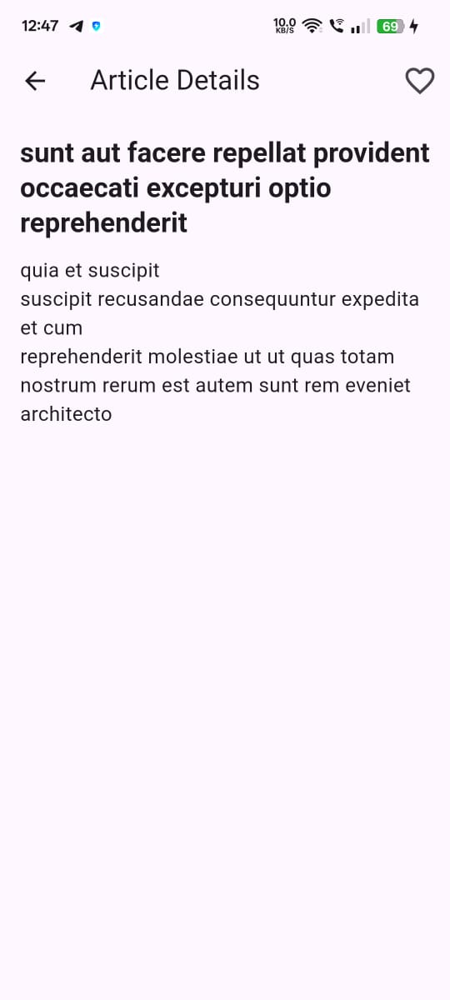

# Flutter Article App

A Flutter app that fetches and displays a list of articles from a public API. The app allows users to browse, search, view article details, and mark articles as favorites.

*BharatNXT India ka Payment*

---

## Assignment Brief

**Objective:**  
Build a mini mobile app in Flutter that displays a list of articles fetched from a public API. The app allows users to browse, search, and view article details.

**Core Features:**

- **Home Screen:**
- Fetch and display articles from: [https://jsonplaceholder.typicode.com/posts](https://jsonplaceholder.typicode.com/posts)
- Display articles in a ListView with cards showing the title and a short preview.
- Show a loading indicator while fetching data.
- Handle API errors gracefully.
- **Search:**
- Add a search bar to filter articles by title or body (client-side search is acceptable).
- **Article Details Screen:**
- On tapping an article, navigate to a detail screen.
- Show the full article content (title and body).

**Technical Expectations:**

- Use Flutter 3+
- Apply a state management solution (BLoC with flutter_bloc)
- Maintain modular, clean code
- Utilize async/await with proper error handling

**Bonus Features (Optional):**

- Implement pull-to-refresh on the article list.
- Add a favorite button along with a dedicated favorites tab.
- Use local storage (e.g., Hive) to persist favorites.

---

## Setup Instructions

1. **Clone the Repository:**

```

git clone https://github.com/ShivtejBhilare/flutter_article_app
cd flutter_article_app

```

2. **Install Dependencies:**

```

flutter pub get

```

3. **Run the App:**

```

flutter run

```

---

## Tech Stack

- **Flutter SDK:** Flutter 3+
- **State Management:** BLoC (using flutter_bloc)
- **HTTP Client:** http (for API calls)
- **Persistence:** Hive (for storing favorites)

---

## State Management Explanation

This application uses the BLoC (Business Logic Component) pattern to separate business logic from the UI. Separate BLoCs handle article fetching, theme management, and favorites management, ensuring a clear data flow and a reactive UI that updates in response to state changes.

---

## Known Issues / Limitations

- API responses from jsonplaceholder may sometimes be slow or return errors.
- UI performance might be improved for very large datasets.
- Additional error handling could be implemented for various network scenarios.
- The UI could be further refined for responsiveness on different screen sizes.

---

## Screenshots

| Feature                  | Screenshot Example                                 |
|--------------------------|---------------------------------------------------|
| App Icon & App Name      |       |
| Splash Screen            |    |
| Home Screen - Light Mode |   |
| Home Screen - Dark Mode  |     |
| Article Details Screen   | |

---

## Additional Information

- **Assets:**  
Ensure all screenshot images are placed in `assets/screenshots/` and declared in `pubspec.yaml`.
- **Submission:**  
Include all source code along with this README file in your GitHub repository or zipped folder submission.

---

## About

This project was developed as part of the BharatNXT Flutter Developer Assignment.

Feel free to adjust any sections or update the image paths to match your project assets.

---

## License

[Specify your license here, if applicable.]

---

## Contact

For any questions or feedback, please contact [Your Name/Email].
```


---